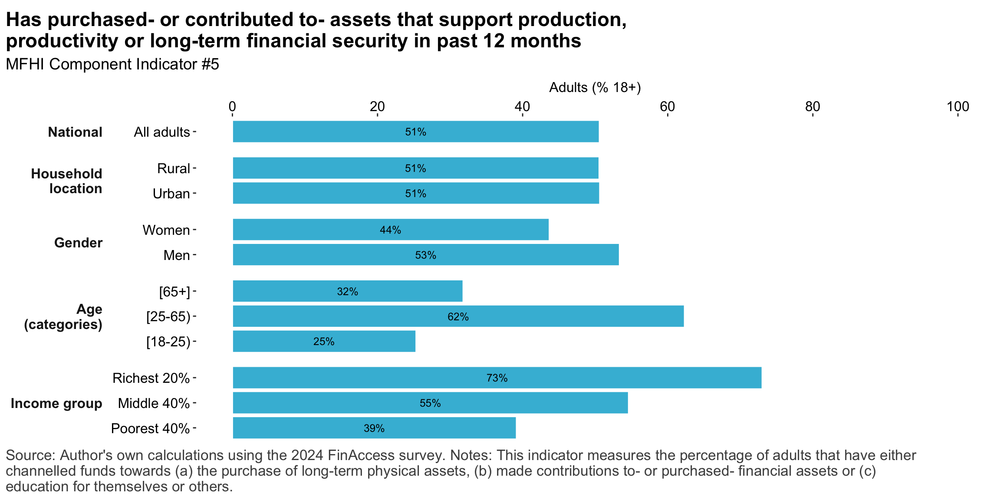
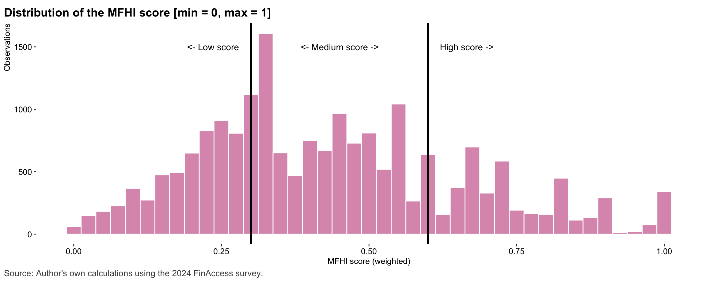

## Managing day-to-day

### Managing food expenses

::: {.cell .caption-margin}
::: {.cell-output-display}
{#fig-mfhi_m2d2_food width=1152}
:::
:::

### MFHI Component indicator #1

::: {.cell .caption-margin}
::: {.cell-output-display}
{#fig-mfhi_m2d2_food_main width=1152}
:::
:::

### Managing core non-food expenses

::: {.cell .caption-margin}
::: {.cell-output-display}
{#fig-mfhi_m2d2_nonfood width=1152}
:::
:::

### MFHI Component indicator #2

::: {.cell .caption-margin}
::: {.cell-output-display}
{#fig-mfhi_m2d2_nonfood_main width=1152}
:::
:::

### Managing debt

::: {.cell .caption-margin}
::: {.cell-output-display}
{#fig-md2d_debt width=1152}
:::
:::

### MFHI Component indicator #3

::: {.cell .caption-margin}
::: {.cell-output-display}
{#fig-mfhi_md2d_debt_main width=1152}
:::
:::

## Coping with risk

### Access to emergency funds

::: {.cell .caption-margin}
::: {.cell-output-display}
{#fig-risk_ef width=1152}
:::
:::

### MFHI Component indicator #4

::: {.cell .caption-margin}
::: {.cell-output-display}
{#fig-mfhi_risk_ef_main width=1152}
:::
:::

## Investing for the future

### Investing in long-term capital

::: {.cell .caption-margin}
::: {.cell-output-display}
{#fig-mfhi_inv_capital width=1152}
:::
:::

### MFHI Component indicator #5

::: {.cell .caption-margin}
::: {.cell-output-display}
{#fig-mfhi_inv_main width=1152}
:::
:::

## Multi-dimensional financial health index

### MFHI component indicators 

::: {.cell .caption-margin}
::: {.cell-output-display}
{#fig-mfhi_comp_indicators width=1152}
:::
:::

### MFHI score

::: {.cell .caption-margin}
::: {.cell-output-display}
{#fig-mfhi_score_hist width=1152}
:::
:::

::: {.cell .caption-margin}
::: {.cell-output-display}
{#fig-mfhi_score_mean width=1152}
:::
:::

### MFHI Score categories

::: {.cell .caption-margin}
::: {.cell-output-display}
{#fig-mfhi_score_cats width=1152}
:::
:::

## Perceptions of financial health

### Worry, confidence and assessments of change in financial status

::: {.cell .caption-margin}
::: {.cell-output-display}
{#fig-pfh width=1152}
:::
:::

### Correlation between financial health perceptions and financial health outcomes 

::: {.cell .caption-margin}

:::
