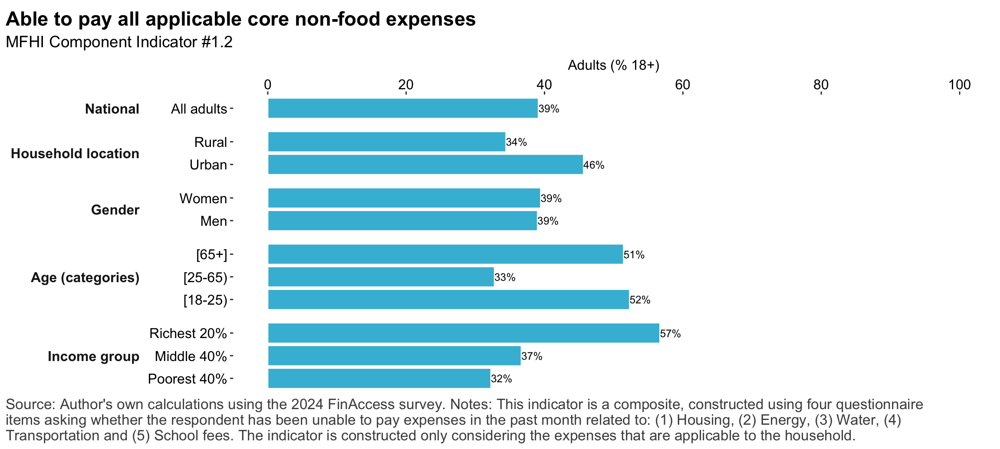
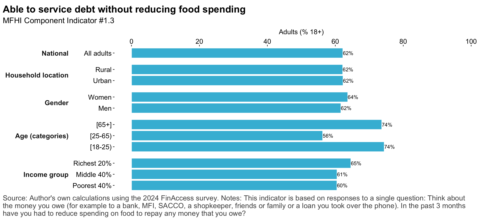
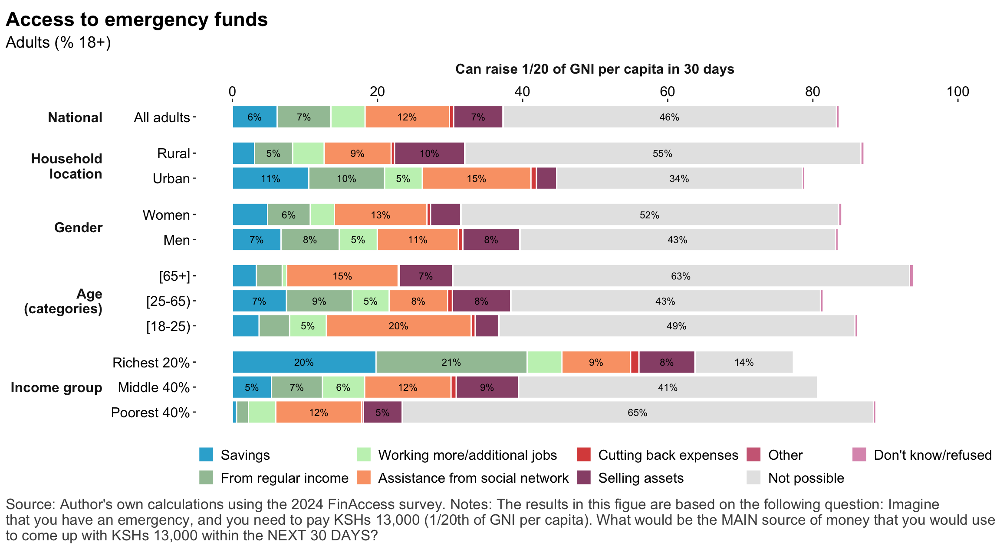
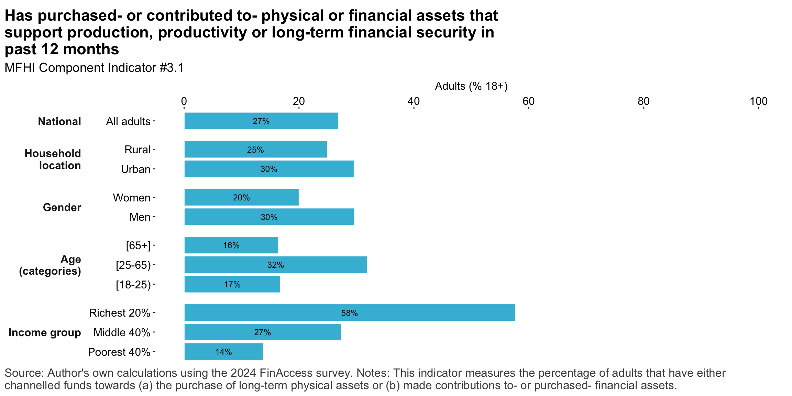
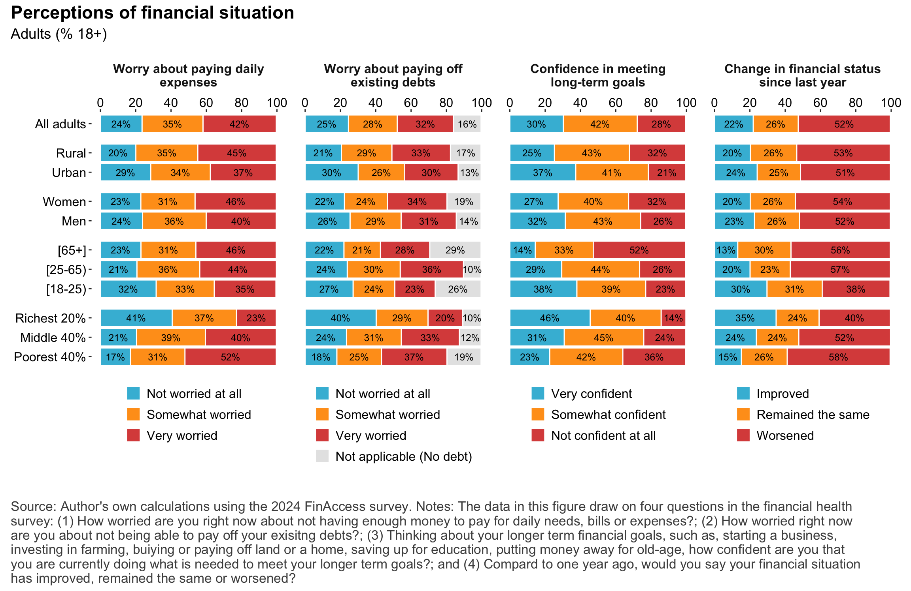
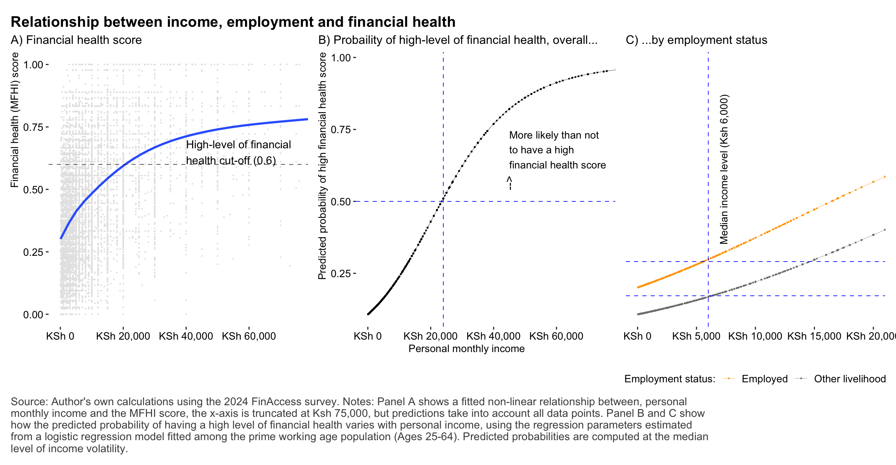

# Contextual factors 

## Main income source


::: {.cell .caption-margin}
::: {.cell-output-display}
{#fig-trends_main_income width=1152}
:::
:::


## Personal monthly income levels 


::: {.cell .caption-margin}
::: {.cell-output-display}
{#fig-trends_income_level width=1152}
:::
:::


# Trends in the financial health index


::: {.cell .caption-margin}
::: {.cell-output-display}
{#fig-mfhi_trends width=1152}
:::
:::


## Subjective evaluations of changes to financial status 


::: {.cell .caption-margin}
::: {.cell-output-display}
{#fig-finstatus-trends width=1152}
:::
:::


## Goals


::: {.cell .caption-margin}
::: {.cell-output-display}
{#fig-trends_goals width=1152}
:::
:::


# The new multi-dimensional financial health index 

## Managing day-to-day

### Managing food expenses


::: {.cell .caption-margin}
::: {.cell-output-display}
{#fig-mfhi_m2d2_food width=1152}
:::
:::


### MFHI Component indicator #1

::: {.cell .caption-margin}
::: {.cell-output-display}
{#fig-mfhi_m2d2_food_main width=1152}
:::
:::


### Managing core non-food expenses

::: {.cell .caption-margin}
::: {.cell-output-display}
{#fig-mfhi_m2d2_nonfood width=1152}
:::
:::


### Managing school fees


::: {.cell .caption-margin}
::: {.cell-output-display}
{#fig-mfhi_m2d2_schoolfees width=1152}
:::
:::

::: {.cell .caption-margin}
::: {.cell-output-display}
{#fig-mfhi_m2d2_healthexp width=1152}
:::
:::


### MFHI Component indicator #2


::: {.cell .caption-margin}
::: {.cell-output-display}
{#fig-mfhi_m2d2_nonfood_main width=1152}
:::
:::


### Managing debt


::: {.cell .caption-margin}
::: {.cell-output-display}
{#fig-md2d_debt width=1152}
:::
:::


### MFHI Component indicator #3


::: {.cell .caption-margin}
::: {.cell-output-display}
{#fig-mfhi_md2d_debt_main width=1152}
:::
:::


## Coping with risk

### Access to emergency funds


::: {.cell .caption-margin}
::: {.cell-output-display}
{#fig-risk_ef width=1152}
:::
:::

::: {.cell .caption-margin}
::: {.cell-output-display}
{#fig-risk_ef_bysource width=1152}
:::
:::

::: {.cell .caption-margin}
::: {.cell-output-display}
{#fig-risk_ef_3d width=1152}
:::
:::


### MFHI Component indicator #4


::: {.cell .caption-margin}
::: {.cell-output-display}
{#fig-mfhi_risk_ef_main width=1152}
:::
:::


## Investing for the future

### Investing in long-term capital

::: {.cell .caption-margin}
::: {.cell-output-display}
{#fig-mfhi_inv_capital width=1152}
:::
:::


### MFHI Component indicator #5

::: {.cell .caption-margin}
::: {.cell-output-display}
{#fig-mfhi_inv_main_c1 width=1152}
:::
:::


### MFHI Component indicator #6

::: {.cell .caption-margin}
::: {.cell-output-display}
{#fig-mfhi_inv_main_c2 width=1152}
:::
:::


## Multi-dimensional financial health index


### MFHI component indicators 


::: {.cell .caption-margin}
::: {.cell-output-display}
{#fig-mfhi_comp_indicators width=1152}
:::
:::


### MFHI component indicators 


::: {.cell .caption-margin}
::: {.cell-output .cell-output-stdout}

```
# A tibble: 33 × 20
   indicator indicator_domain indicator_category indicator_stem indicator_branch
   <chr>     <chr>            <chr>              <chr>          <chr>           
 1 mfhi_sco… Financial healt… MFHI (gradated)    Managing day … Score (mean)    
 2 mfhi_sco… Financial healt… MFHI (gradated)    Coping with r… Score (mean)    
 3 mfhi_sco… Financial healt… MFHI (gradated)    Investing in … Score (mean)    
 4 mfhi_sco… Financial healt… MFHI (gradated)    Managing day … Score (mean)    
 5 mfhi_sco… Financial healt… MFHI (gradated)    Managing day … Score (mean)    
 6 mfhi_sco… Financial healt… MFHI (gradated)    Coping with r… Score (mean)    
 7 mfhi_sco… Financial healt… MFHI (gradated)    Coping with r… Score (mean)    
 8 mfhi_sco… Financial healt… MFHI (gradated)    Investing in … Score (mean)    
 9 mfhi_sco… Financial healt… MFHI (gradated)    Investing in … Score (mean)    
10 mfhi_sco… Financial healt… MFHI (gradated)    Managing day … Score (mean)    
# ℹ 23 more rows
# ℹ 15 more variables: group <chr>, group_name <chr>, group_cat_val <chr>,
#   nobs <int>, total <dbl>, total_low <dbl>, total_upp <dbl>, mean <dbl>,
#   mean_low <dbl>, mean_upp <dbl>, median <dbl>, median_low <dbl>,
#   median_upp <dbl>, indicator_name <chr>, indicator_group <chr>
```


:::
:::


### MFHI score


::: {.cell .caption-margin}
::: {.cell-output-display}
{#fig-mfhi_score_hist width=1152}
:::
:::

::: {.cell .caption-margin}
::: {.cell-output-display}
{#fig-mfhi_score_mean width=1152}
:::
:::


### MFHI Score categories


::: {.cell .caption-margin}
::: {.cell-output-display}
{#fig-mfhi_score_cats width=1152}
:::
:::


## Perceptions of financial health

### Worry, confidence and assessments of change in financial status

::: {.cell .caption-margin}
::: {.cell-output-display}
{#fig-pfh width=1152}
:::
:::

::: {.cell .caption-margin}
::: {.cell-output-display}
{#fig-mfhi_pfh_corr width=1152}
:::
:::

::: {.cell .caption-margin}
::: {.cell-output-display}
{#fig-reg_pfhscorehi_drivers width=1152}
:::
:::


# Drivers of financial lhealth

### Financial health and income


::: {.cell .caption-margin}
::: {.cell-output-display}
{#fig-mfhi_inc_corr width=1152}
:::
:::


### Predictors of financial health


::: {.cell .caption-margin}
::: {.cell-output-display}
{#fig-reg_fhscorehi_drivers width=1152}
:::
:::

::: {.cell .caption-margin}
::: {.cell-output-display}
{#fig-reg_fhscorehi_drivers2 width=1152}
:::
:::
